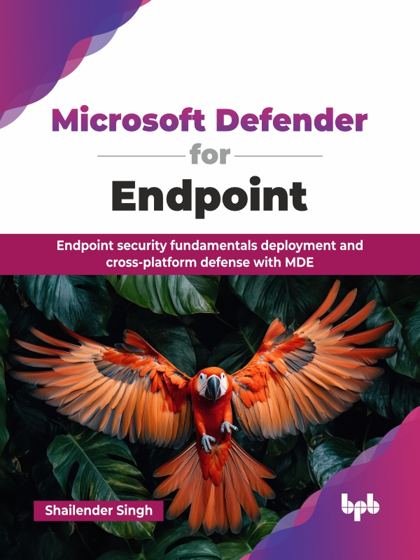

# Microsoft Defender for Endpoint

Endpoint security fundamentals deployment and cross-platform defense with MDE.

This is the repository for [Microsoft Defender for Endpoint
](https://bpbonline.com/products/microsoft-defender-for-endpoint?variant=44609137049800),published by BPB Publications.

## About the Book
Microsoft Defender for Endpoint is a powerful tool for securing your environment, and this book is your practical guide to using it effectively. Written by an engineer who works hands-on with the daily challenges of IT infrastructure, it covers everything from on-prem data centers to cloud platforms like AWS, Azure, and GCP, across Windows, Linux, macOS, Android, and Kubernetes.

This book offers a focused, practical guide to MDE, covering its architecture, evolution, and key features. While centered on MDE, it also addresses broader cybersecurity concepts relevant to DevOps, SREs, developers, system administrators, and newcomers entering the field. You will explore endpoint protection principles, the threat landscape, and frameworks like MITRE ATT&CK, along with deployment across Windows, macOS, and Linux. It covers EDR, SOC operations, data protection with Microsoft Purview, and incident response using Live Response. With rising threats powered by AI, deepfakes, and organized cybercrime, this guide prepares you to secure hybrid and cloud infrastructures using Microsoft Defender for Azure and Microsoft 365, backed by practical configurations, case studies, and a forward-looking view of endpoint security.

By the time you reach the final chapter, you will possess a strong technical understanding of MDE, equipped with the practical knowledge to confidently implement, manage, and leverage its full capabilities to defend your digital assets and enhance your organization's security posture.

## What You Will Learn
• Understanding of security domains like XDR, MDR, EDR, CASB, TVM, etc. 

• Learn to perform the SOC analyst and security administrator roles using Microsoft security products.

• Security incident management and problem management using Microsoft security.

• Advanced hunting queries like Kusto Query Language (KQL).

• Management of MDE and endpoints through Microsoft Intune Endpoint Manager.

• Management of MDE using the Security Web Portal.

• Learn cloud and container security and DevSecOps techniques around it.

• Learn cross-platform (Linux, macOS, and Android) endpoint security.
